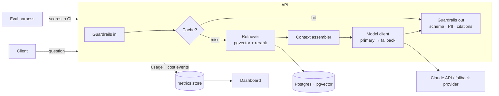

# modelgate

> A production-shaped AI service. The interesting part isn't the model call — it's
> the engineering around it: an eval harness, cost and latency accounting,
> caching, model fallback, streaming, and guardrails.

[](#)
[](#)
[](LICENSE)

**Live demo:** _pending_

---

## Why this exists

Wiring an LLM into an app is a weekend. Making it reliable, measurable, and
affordable is the actual job. `modelgate` is a retrieval-augmented answering
service built the way a backend engineer would build any other dependency:
with SLOs, tests, a cost budget, and a fallback plan for when the provider is
slow or down.

## What it demonstrates

- **RAG pipeline** — chunking, embeddings, `pgvector` retrieval, re-ranking,
  context assembly with citation tracking.
- **Eval harness** — a versioned dataset of question/answer/context cases scored
  on faithfulness, answer relevance, and retrieval hit-rate. Runs in CI; a
  regression fails the build.
- **Cost & latency accounting** — every request records tokens in/out, model,
  cache hit, retrieval time, and dollar cost; aggregated on a dashboard.
- **Caching** — exact-match and semantic response cache with TTL and
  invalidation, measured hit-rate.
- **Model fallback** — primary → secondary model on timeout / error / rate limit,
  with the downgrade recorded.
- **Streaming** — token streaming over SSE with mid-stream cancellation.
- **Guardrails** — input validation, prompt-injection heuristics, output schema
  validation, PII redaction, refusal handling.
- **Reproducibility** — pinned model IDs, pinned prompts, prompt changes are
  reviewed like code.

## Architecture



## Tech stack

| Area | Choice |
|------|--------|
| Language | TypeScript (Node.js) |
| Model API | Claude (`claude-sonnet-5` primary), configurable fallback |
| Vectors | PostgreSQL + `pgvector` |
| Transport | HTTP + SSE streaming |
| Evals | custom harness (faithfulness / relevance / hit-rate), runs in CI |
| Observability | per-request usage events → Postgres → Grafana |
| Tests | Vitest + Testcontainers; recorded-fixture provider for deterministic runs |

## Getting started

```bash
git clone https://github.com/ingo4it/modelgate.git
cd modelgate
cp .env.example .env          # set ANTHROPIC_API_KEY
docker compose up -d          # postgres + pgvector, grafana
pnpm install
pnpm migrate
pnpm ingest ./corpus         # embed a sample corpus
pnpm dev
pnpm eval                    # run the eval suite, print scores
```

## Eval results

Committed under `evals/results/` and rendered in CI:

| Metric | Score | Target |
|--------|------:|-------:|
| Faithfulness | _tbd_ | ≥ 0.90 |
| Answer relevance | _tbd_ | ≥ 0.85 |
| Retrieval hit-rate @5 | _tbd_ | ≥ 0.80 |
| p95 latency (cache miss) | _tbd_ | ≤ 4 s |
| Cost / 1k requests | _tbd_ | tracked |

## Project layout

```
src/
  guardrails/    input + output validation, PII, injection heuristics
  retrieval/     chunking, embeddings, pgvector search, rerank
  model/         provider clients, fallback policy, streaming
  cache/         exact + semantic cache
  usage/         token / cost / latency events
evals/           dataset, scorers, committed results
corpus/          sample documents
docs/adr/        architecture decision records
```

## Design notes

ADRs in [`docs/adr/`](docs/adr/):

- ADR-001 — pgvector over a dedicated vector DB at this scale
- ADR-002 — Eval-in-CI as a release gate; how the dataset is versioned
- ADR-003 — Fallback policy: when to downgrade vs. fail fast
- ADR-004 — Semantic cache correctness / staleness tradeoffs

## Roadmap

- [ ] Tool-use / function-calling path with its own evals
- [ ] Per-tenant cost budgets + throttling
- [ ] Offline eval report as a PR comment
- [ ] Shadow-traffic harness for prompt changes

## License

MIT © Frank Rao — [frankrao.com](https://frankrao.com)
