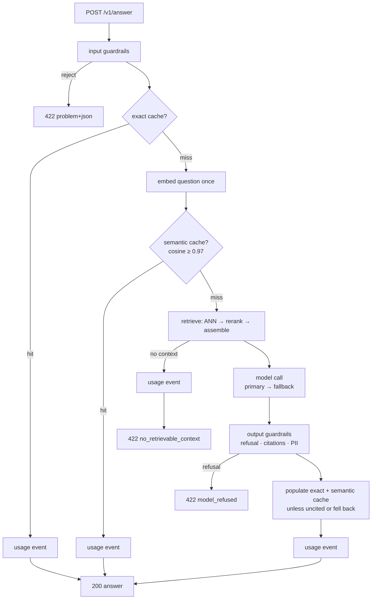
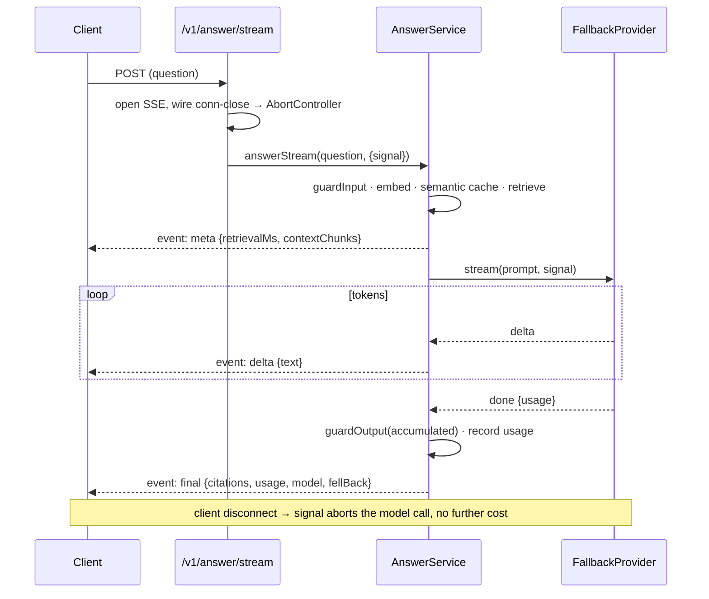

# Architecture

## Shape

```
src/
  index.ts            start, sweep timer, listen, graceful shutdown
  server/             config (zod), deps (composition root), app (pure buildApp),
                      health, shutdown, errors + error-handler plugin
  core/types.ts       Citation, RetrievedChunk, AssembledContext, AnswerResult
  guardrails/         input (size, control chars, injection) · output (refusal,
                      citation integrity, groundedness, PII redaction)
  retrieval/          chunk · embeddings (Embedder: Voyage | Fixture) ·
                      store (VectorSearch: pgvector | in-memory) · rerank ·
                      assemble (numbered context + citation mapping) · pipeline
  model/              provider (ModelProvider) · anthropic · fixture · fallback
                      (FallbackProvider) · prompt (pinned, versioned)
  cache/              key (normalise) · exact (Redis) · semantic (pgvector)
  usage/              cost (price book) · events (UsageRecorder + summary)
  answer/             answer.service (the orchestrator) · routes · schema
  ingest/ingest.ts    corpus → chunk → embed → upsert CLI
evals/                dataset · scorers · run.ts · fixtures · results
```

Dependency rule: `routes → service → (retrieval | model | cache | usage)`.
Every external dependency is behind an interface — `Embedder`, `VectorSearch`,
`ModelProvider`, and the `ExactCachePort` / `SemanticCachePort` / `UsageSink`
ports on the service — so the eval harness and unit tests run the real
orchestrator against in-memory doubles, no database or API key.

## Request flow



Every terminal path — cache hit, no-context, refusal, success — writes exactly
one `UsageEvent` (model, fallback flag, cache outcome, tokens, per-stage
latency, estimated cost). The cost/latency dashboard is a set of SQL queries
over that table.

## Streaming



Fallback in streaming mode only happens **before the first token** — once bytes
are on the wire the stream can't restart cleanly (ADR-0003).

## Why the pieces are where they are

- **`AnswerService` is the only place the flow lives.** Routes parse and
  serialise; retrieval / model / cache / guardrails are single-purpose
  collaborators it composes. Read one file to see the whole pipeline.
- **Embeddings come from Voyage, not Anthropic** — Anthropic has no embeddings
  endpoint. `Embedder` is the seam; `FixtureEmbedder` (deterministic hash
  vectors) is what makes the eval suite offline.
- **The prompt is pinned** (`model/prompt.ts`, `PROMPT_VERSION`). A change is a
  code review and re-records eval fixtures.
- **Two caches, checked cheapest-first** — exact (Redis, normalised key) then
  semantic (pgvector, high threshold). Neither caches an uncited or
  fallback-model answer.
